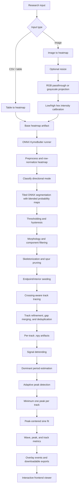

# WaveAtlas

WaveAtlas is a data analysis and visualization platform for turning kymograph-style research data into quantitative, inspectable wave dynamics. It accepts tabular intensity data or color-mapped image uploads, converts them into analysis-ready heatmaps, runs a KymoButler-inspired ONNX/Python extraction pipeline, and presents the resulting tracks, peaks, regressions, and metrics in an interactive browser viewer.

The goal is not just to run a model. WaveAtlas is built as an end-to-end research instrument: input normalization, model inference, geometric track reconstruction, peak-centered signal analysis, durable artifact storage, live job state, and visual quality control all live in one coherent workflow.

## What It Does

WaveAtlas converts raw experimental inputs into structured wave data:

- Uploads CSV-style tabular intensity matrices or image files.
- Normalizes images into heatmaps, including optional grayscale conversion through user-defined low/high intensity colors.
- Runs ONNX segmentation models to identify track-like signal structures across the kymograph.
- Skeletonizes and traces those structures into per-track coordinate arrays.
- Extracts wave peaks from every track and computes peak-centered sinusoidal regressions.
- Produces per-track, per-wave, and per-peak metrics including amplitude, period, frequency, velocity, wavelength, local fit error, and frame/position windows.
- Streams analysis progress and overlay tracks to the frontend as the backend processes the run.
- Stores raw uploads, generated heatmaps, overlays, track arrays, CSV exports, and debug artifacts for review or download.

## Pipeline

The extraction core is a Python/ONNX reimplementation of the original KymoButler-style workflow, extended with application-level ingestion, persistence, and visualization.

## Technical Architecture

WaveAtlas is structured as a full-stack analysis service with a clear separation between computation, persistence, and presentation.

- The backend is a FastAPI application that owns uploads, job orchestration, WebSocket event streaming, artifact retrieval, and CSV exports.
- The analysis pipeline is implemented in Python with NumPy, SciPy, scikit-image, OpenCV, and ONNX Runtime.
- The ML layer uses four ONNX model assets: unidirectional segmentation, bidirectional segmentation, mode classification, and crossing decision inference.
- Job/session state is persisted through SQLModel and Alembic-managed relational schema migrations.
- Artifact storage is abstracted behind local and Google Cloud Storage backends, so the same pipeline can publish uploads, heatmaps, overlays, track arrays, debug images, and exports without binding analysis code to one storage provider.
- The React/Vite frontend consumes the same API surface used by production, including live run status, overlay track events, artifact downloads, and track-detail data.
- The production container bakes the frontend bundle and ONNX models into the backend image, allowing one Cloud Run service to serve both the application UI and API.

## Analysis Model

WaveAtlas treats each extracted track as both geometry and signal. The raw track describes position over frame/time; the residual after detrending describes the oscillatory wave component. This lets the platform preserve the visual trace while computing metrics that are tied to specific peaks and frame windows.

For each track, WaveAtlas estimates a dominant frequency, detects candidate peaks, guarantees at least one peak for downstream analysis, and computes a local anchored sine fit centered on each peak. The fit is constrained to pass through the detected peak, which makes the regression visually and numerically accountable to the feature being measured. A configurable fraction of the local period defines the fit window, so each peak can be inspected as a local wave event rather than as an opaque whole-track summary.

The resulting data model supports three complementary views:

- Track-level summaries for filtering, browsing, and quality control.
- Wave-level rows for amplitude, frequency, period, wavelength, velocity, and frame/position windows.
- Peak-level rows for local peak properties, prominence, fit parameters, and fit error.

## Viewer

The frontend is designed for researcher-facing inspection rather than passive reporting. It overlays extracted tracks on the heatmap, exposes run progress and artifacts, and lets users drill into individual tracks. Track detail views can show raw signal, detrended residuals, detected peaks, axes, and peak-specific regressions so the numeric outputs remain visually auditable.

Downloads are first-class outputs. Researchers can retrieve raw metrics, track data, processed overlays, original uploads, generated heatmaps, and debug artifacts without leaving the run context.

## Deployment Shape

WaveAtlas is designed for a simple production footprint:

- One Cloud Run service serves both the FastAPI backend and compiled frontend.
- ONNX models are baked into the container for deterministic inference and no runtime model download dependency.
- Cloud SQL stores job, artifact, track, wave, peak, and event metadata.
- Google Cloud Storage stores large binary artifacts and generated outputs.
- Google-managed HTTPS and Cloud Run custom domain mappings put the application behind a researcher-friendly domain.

This keeps the operational surface small while preserving a path to scale: long-running or high-throughput processing can move into a dedicated worker later without changing the core data model or frontend contract.

## Why WaveAtlas Matters

Many analysis tools stop at either model inference or static metrics. WaveAtlas connects the full chain: experimental upload, ML-assisted extraction, signal processing, visual verification, structured metrics, and reproducible exports. The result is a platform that can support exploratory research, pipeline tuning, and publication-grade quantitative review from the same interface.

